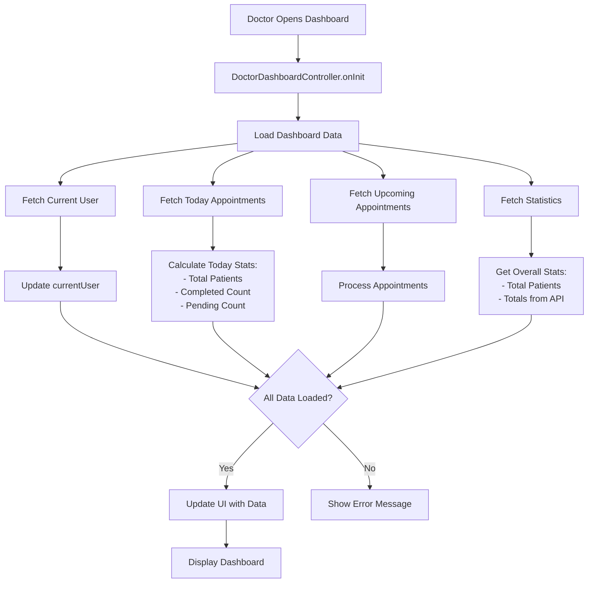

# 👨‍⚕️ Doctor Dashboard - Complete Guide

## 📋 Table of Contents
1. [Overview](#overview)
2. [Dashboard Layout](#dashboard-layout)
3. [All Features Explained](#all-features-explained)
4. [How It Works](#how-it-works)
5. [UI Components](#ui-components)
6. [Navigation](#navigation)

---

## Overview

The **Doctor Dashboard** is the main hub for doctors to manage their appointments, patients, schedules, and professional settings. It provides a quick overview of daily activities and easy access to all doctor features.

### Key Information Displayed:
- ✅ Today's appointments and statistics
- ✅ Upcoming appointments
- ✅ Patient information
- ✅ Practice schedule and timing
- ✅ Medicine reminders for patients
- ✅ Booking settings and configuration

---

## Dashboard Layout

### 1. **App Bar (Top Navigation)**
```
┌─────────────────────────────────────────┐
│ [Logo]  Doctor Dashboard  [🔔 Notifications] │
└─────────────────────────────────────────┘
```

**Features:**
- **Logo Menu Button**: Opens the navigation drawer
- **Title**: "Doctor Dashboard" - Current page indicator
- **Notification Icon**: Quick access to notifications

---

### 2. **Welcome Card Section**
```
┌─────────────────────────────────────────┐
│ [👨‍⚕️]  Good Morning             │
│         Dr. Ahmed Hassan        │
│         Cardiology Department   │
└─────────────────────────────────────────┘
```

**What It Shows:**
| Element | Purpose |
|---------|---------|
| **Profile Picture** | Doctor's profile image (or initials if no image) |
| **Greeting** | Changes based on time of day (Morning/Afternoon/Evening) |
| **Doctor Name** | Full name with "Dr." prefix |
| **Department** | Medical specialty/department |

**How It Works:**
- Greeting updates dynamically:
  - 🌅 Before 12 PM: "Good Morning"
  - 🌤️ 12 PM - 5 PM: "Good Afternoon"
  - 🌙 After 5 PM: "Good Evening"

**Profile Image:**
- Shows doctor's profile picture from account
- Falls back to initials (first letter of name) if image unavailable
- Has error handling for broken image URLs

---

### 3. **Statistics Cards Section**
```
┌──────────────┬──────────────┬──────────────┐
│ 👥           │ ✅           │ ⏳           │
│              │              │              │
│      8       │      5       │      3       │
│              │              │              │
│ Today's      │ Completed    │ Pending      │
│ Patients     │              │              │
└──────────────┴──────────────┴──────────────┘
```

**Statistics Tracked:**

| Card | Shows | Color | Purpose |
|------|-------|-------|---------|
| **Today's Patients** | Total patient count for today | 🔵 Blue | Overview of daily workload |
| **Completed** | Number of completed appointments | 🟢 Green | Track finished consultations |
| **Pending** | Number of scheduled appointments | 🟠 Orange | Appointments still to be done |

**How It Works:**
- Data is fetched from backend API
- Updates in real-time when dashboard loads
- Statistics are calculated from appointment status
- Pull down to refresh the numbers

---

### 4. **Quick Actions Section**
```
┌─────────────────────────────────────────┐
│          QUICK ACTIONS                   │
├──────────────┬──────────────────────────┤
│ 📅           │ 👥                       │
│ View         │ Patients                 │
│ Schedule     │                          │
├──────────────┬──────────────────────────┤
│ 📋           │ 👤                       │
│ All          │ Profile                  │
│ Appointments │                          │
├──────────────┬──────────────────────────┤
│ 💊           │ ⚙️                       │
│ Medicine     │ Booking                  │
│ Reminders    │ Settings                 │
└──────────────┴──────────────────────────┘
```

**All Quick Action Buttons:**

| Button | Icon | Color | Action | Where It Goes |
|--------|------|-------|--------|---------------|
| **View Schedule** | 📅 Calendar | 🔵 Blue | Opens doctor's weekly schedule | Schedule Management |
| **Patients** | 👥 People | 🟢 Green | View all patients from past appointments | Patients List |
| **All Appointments** | 📋 List | 🟠 Orange | See all upcoming and past appointments | All Appointments Page |
| **Profile** | 👤 Person | 🟣 Purple | Edit doctor profile information | Profile Screen |
| **Medicine Reminders** | 💊 Medication | 🔴 Red | Manage patient medication reminders | Medicine Reminders |
| **Booking Settings** | ⚙️ Settings | 🟣 Purple | Configure appointment booking rules | Booking Settings |

**How It Works:**
- Each button is a quick shortcut to a feature
- Tap any button to navigate to that module
- All buttons use smooth animations
- Icons and colors make them easy to identify

---

### 5. **Today's Appointments Section**
```
┌─────────────────────────────────────────┐
│ TODAY'S APPOINTMENTS         [View All] │
├─────────────────────────────────────────┤
│ [👥] Ahmed Malik                   │   │
│      Fever and cough    [SCHEDULED]│   │
│      📅 Apr 16, 2025    ⏰ 10:00 AM│   │
├─────────────────────────────────────────┤
│ [👥] Fatima Khan                   │   │
│      Chest pain         [COMPLETED]│   │
│      📅 Apr 16, 2025    ⏰ 02:30 PM│   │
├─────────────────────────────────────────┤
│ [👥] Hassan Ali                    │   │
│      Back pain          [IN PROGRESS]   │
│      📅 Apr 16, 2025    ⏰ 11:15 AM│   │
└─────────────────────────────────────────┘
```

**Information Displayed:**

| Field | Shows | Example |
|-------|-------|---------|
| **Patient Avatar** | Circle with patient initial or photo | 👥 A |
| **Patient Name** | Full name of the patient | Ahmed Malik |
| **Appointment Reason** | Chief complaint/reason for visit | Fever and cough |
| **Status Badge** | Current appointment status with color | 🔵 SCHEDULED |
| **Date** | Appointment date in MMM DD, YYYY format | Apr 16, 2025 |
| **Time** | Appointment time in 12-hour format | 10:00 AM |

**Status Badges & Meanings:**

| Status | Color | Meaning |
|--------|-------|---------|
| **SCHEDULED** | 🔵 Blue | Appointment booked, waiting |
| **COMPLETED** | 🟢 Green | Consultation finished |
| **IN PROGRESS** | 🟠 Orange | Currently consulting with patient |
| **CANCELLED** | 🔴 Red | Appointment cancelled |

**Features:**
- **Maximum 3 appointments shown** (if more exist, "View All" link appears)
- **Tap any appointment** to see full details
- **Empty state** shows message if no appointments today
- **Refreshable** by pulling down

**How It Works:**
1. Dashboard loads all appointments for today
2. Sorts by appointment time
3. Displays up to 3 most recent
4. Shows "View All" button if more exist
5. Status calculated from appointment record
6. Color-coded for quick visual scanning

---

### 6. **Upcoming Appointments Section**
```
┌─────────────────────────────────────────┐
│ UPCOMING APPOINTMENTS                    │
├─────────────────────────────────────────┤
│ [👥] Zara Shah                     │   │
│      Diabetes checkup    [SCHEDULED]│   │
│      📅 Apr 17, 2025    ⏰ 09:00 AM│   │
├─────────────────────────────────────────┤
│ [👥] Salman Khan                   │   │
│      Eye exam           [SCHEDULED]│   │
│      📅 Apr 17, 2025    ⏰ 03:00 PM│   │
└─────────────────────────────────────────┘
```

**Details:**
- Shows appointments **scheduled for future dates** (tomorrow onwards)
- Maximum **2 appointments** displayed
- Same card layout as today's appointments
- Hidden if no upcoming appointments exist
- Tap to view full appointment details

---

## All Features Explained

### 1. **Drawer Menu (Side Navigation)**
```
┌─────────────────────────────┐
│ [👨‍⚕️ Ahmed Hassan] │
│ ahmed@hospital.com          │
├─────────────────────────────┤
│ 📊 Dashboard   [✓ Current]  │
│ 📅 My Appointments          │
│ 👥 Patients                 │
│ 📋 My Schedule              │
├─────────────────────────────┤
│ 👤 Profile                  │
│ 💊 Medicine Reminders       │
│ ⚙️ Booking Settings         │
├─────────────────────────────┤
│ 🚪 Logout (Red)             │
└─────────────────────────────┘
```

**Navigation Items:**
| Item | Icon | Purpose | Route |
|------|------|---------|-------|
| Dashboard | 📊 | Current page (highlighted) | /doctor-dashboard |
| My Appointments | 📅 | View all appointments | /my-appointments |
| Patients | 👥 | Patient management list | /patients |
| My Schedule | 📋 | Set availability times | /schedule |
| Profile | 👤 | Edit doctor profile | /profile |
| Medicine Reminders | 💊 | Manage patient reminders | /doctor-medicine-reminders |
| Booking Settings | ⚙️ | Configure appointment booking | /booking-settings |
| Logout | 🚪 | Sign out of account | /login |

**How It Works:**
- Tap drawer icon or swipe from left edge to open
- Shows doctor's profile at top
- Current page is highlighted (Dashboard)
- Tap any item to navigate
- Closes after navigation
- Logout clears session and returns to login

---

### 2. **Real-Time Notifications**
The dashboard checks for new appointments every **30 seconds**:

```
Event Flow:
┌─────────────┐
│ Load Data   │ (On dashboard open)
└────┬────────┘
     │
     ▼
┌─────────────────────────────┐
│ Timer Every 30 Seconds      │
│ Check for New Appointments  │
└────┬────────────────────────┘
     │
     ▼
┌─────────────────────────────┐
│ New Appointment Found?      │
└────┬────────────────────────┘
     │
   YES ▼                  NO
┌───────────────┐    (Wait)
│ Show Toast    │
│ "You have 1  │
│ new appt(s)" │
└───────────────┘
     │
     ▼
  Reload Data
```

**How Notifications Work:**
1. **Automatic checking**: Runs every 30 seconds (if enabled in settings)
2. **Checks setting**: Retrieves `pushNotifications` preference
3. **Compares timestamps**: Looks for appointments created after last check
4. **Shows notification**: Toast message at top with appointment count
5. **Tap notification**: Takes you to "All Appointments" page
6. **Auto-hides**: Message disappears after 5 seconds

**Notification Setting:**
- Can be disabled/enabled in app settings
- Independent for each user
- Persists across sessions

---

### 3. **Pull-to-Refresh**
```
Swipe down ▼
           │
           ▼
    ┌──────────────┐
    │ 🔄 Refreshing│
    │  Loading... │
    └──────────────┘
           │
  Wait 2-3 seconds
           │
           ▼
    ┌──────────────┐
    │ ✅ Updated!  │
    │  New data... │
    └──────────────┘
```

**How It Works:**
1. Pull screen downward with finger
2. Refresh indicator appears (spinning circle)
3. System fetches:
   - Current user info
   - Today's appointments
   - Upcoming appointments
   - Statistics (totals, completed, pending)
4. Data updates on screen
5. Indicator disappears
6. Works whether online or offline

---

## How It Works

### Data Flow: Loading Dashboard



### State Management (Using GetX)

**Observable States:**
```dart
// User Data
Rx<User?> currentUser          // Doctor's profile info

// Appointments
RxList<Appointment> todayAppointments       // Today's appointments
RxList<Appointment> upcomingAppointments    // Future appointments

// Statistics
RxInt totalPatientsToday       // How many patients today
RxInt completedToday           // Completed consultations
RxInt pendingToday             // Pending appointments
RxInt totalPatients            // Total patients managed

// UI States
RxBool isLoading               // Loading indicator
```

**When any state changes → UI automatically updates**

---

### Data Sources (API Endpoints)

1. **Authentication**: Get current logged-in doctor
   ```
   GET /Users/profile
   → Returns: User object with doctor info
   ```

2. **Today's Appointments**:
   ```
   GET /Doctors/appointments/today
   → Returns: List of Appointment objects
   ```

3. **Upcoming Appointments**:
   ```
   GET /Doctors/appointments/upcoming
   → Returns: List of future Appointment objects
   ```

4. **Statistics**:
   ```
   GET /Doctors/statistics
   → Returns: {
       "totalPatients": 150,
       "todayTotal": 8,
       "completedToday": 5,
       "pendingToday": 3
     }
   ```

---

## UI Components

### Color Scheme

```
Primary Colors:
- Primary: #0066CC (Blue) - Main buttons, headers
- Secondary: #003D6E (Dark Blue) - Gradients
- Background: #F5F5F5 (Light Gray) - Page background

Status Colors:
- Scheduled: #2196F3 (Blue)
- Completed: #4CAF50 (Green)
- In Progress: #FF9800 (Orange)
- Cancelled: #F44336 (Red)
- Pending: #FF9800 (Orange)

Action Colors:
- View Schedule: #2196F3 (Blue)
- Patients: #4CAF50 (Green)
- All Appointments: #FF9800 (Orange)
- Profile: #9C27B0 (Purple)
- Medicine Reminders: #E91E63 (Pink)
- Booking Settings: #673AB7 (Purple)
```

### Typography

| Element | Font Size | Weight | Color |
|---------|-----------|--------|-------|
| App Bar Title | 16 | Normal | White |
| Welcome Card Greeting | 14 | Normal | White70 |
| Welcome Card Name | 20 | Bold | White |
| Welcome Card Department | 12 | Normal | White70 |
| Section Heading | 18 | Bold | Primary |
| Card Title | 16 | Bold | Primary |
| Card Subtitle | 14 | Normal | Gray600 |
| Status Badge | 12 | W600 | Status Color |
| Stat Value | 24 | Bold | Color |
| Stat Label | 11 | Normal | Gray600 |

### Card Styling

**Appointment Cards:**
- White background with rounded corners (12 dp)
- Shadow: Elevation 4
- Padding: 16 dp all sides
- Divider: 1 dp line separator
- Border: None (uses shadow for depth)

**Statistics Cards:**
- White background with rounded corners (12 dp)
- Shadow: Elevation 4
- Padding: 16 dp all sides
- Border: None

**Quick Action Buttons:**
- White background with rounded corners (12 dp)
- Colored border (30% opacity of button color)
- Shadow: Elevation 4
- Padding: 16 dp vertical, 12 dp horizontal

---

## Navigation

### Navigation Flow

```
Doctor Dashboard (Home)
    ├── 📅 View Schedule
    │   └── Schedule Management (Set availability times)
    │
    ├── 👥 Patients
    │   └── Patients List (All patients)
    │       └── Patient Detail (Individual patient info)
    │
    ├── 📋 All Appointments
    │   └── Appointments List
    │       └── Appointment Detail
    │           └── Write Prescription
    │
    ├── 👤 Profile
    │   └── Profile Editor
    │
    ├── 💊 Medicine Reminders
    │   └── Reminder Management
    │
    ├── ⚙️ Booking Settings
    │   └── Appointment Configuration
    │
    └── 🚪 Logout
        └── Login Screen
```

### How Navigation Works

**Method 1: Quick Action Buttons**
```dart
// Example: Viewing Schedule
_buildActionButton(
  'View Schedule',
  Icons.calendar_month,
  const Color(0xFF2196F3),
  controller.viewSchedule,  // ← Tap calls this
)

// In controller:
void viewSchedule() {
  Get.toNamed(AppRoutes.schedule);  // Navigate to schedule
}
```

**Method 2: Drawer Menu**
```dart
ListTile(
  leading: const Icon(Icons.schedule_outlined),
  title: const Text('My Schedule'),
  onTap: () {
    Get.back();  // Close drawer
    controller.viewSchedule();  // Navigate
  },
)
```

**Method 3: Card Tap**
```dart
InkWell(
  onTap: () => controller.viewAppointment(appointment),
  // Opens Appointment Detail with appointment data
)
```

---

## Key Features Summary

### ✅ Smart Features Included:

1. **Intelligent Greeting** - Changes based on time of day
2. **Dynamic Statistics** - Real-time calculation from appointments
3. **Auto-Refresh** - Automatic checking for new appointments
4. **Error Handling** - Graceful fallbacks for missing data
5. **Offline Support** - Caches data locally
6. **Image Handling** - Falls back to initials if image fails
7. **Status Tracking** - Color-coded appointment statuses
8. **Quick Access** - 6 quick action buttons for main features
9. **Navigation** - Multiple ways to access features
10. **Responsive Design** - Works on all screen sizes

---

## Best Practices for Doctors

### ✨ Tips for Using Doctor Dashboard:

1. **Check Dashboard First** - Get overview of the day's workload
2. **Use Quick Actions** - Faster navigation than drawer menu
3. **Monitor Notifications** - Enables real-time appointment alerts
4. **Manage Schedule** - Set availability before opening for patients
5. **Update Settings** - Configure booking preferences
6. **Review Statistics** - Track work performance
7. **Pull to Refresh** - When something seems outdated
8. **Tap Appointments** - To see full patient details
9. **Use Drawer** - For less frequently accessed features
10. **Set Reminders** - For patient medication adherence

---

## Troubleshooting

### Issue: Dashboard Shows Loading

**Solution:**
- Check internet connection
- Wait 3-5 seconds for data to load
- Pull down to refresh manually
- Try logging out and back in

### Issue: Statistics Don't Update

**Solution:**
- Pull down to refresh
- Check if appointments changed
- Verify appointments have correct status
- Clear app cache and reload

### Issue: Notification Not Appearing

**Solution:**
- Enable push notifications in settings
- Ensure dashboard is open
- Check if new appointments exist
- Notification appears every 30 seconds only

### Issue: Profile Picture Not Showing

**Solution:**
- Picture falls back to name initial automatically
- Check profile has valid image URL
- Try uploading new profile picture
- Refresh dashboard

---

## File Structure

```
lib/app/modules/doctor/dashboard/
├── dashboard_binding.dart      (Dependency injection)
├── dashboard_controller.dart   (Business logic & state)
└── dashboard_screen.dart       (UI components)
```

### Related Modules:

```
lib/app/modules/doctor/
├── dashboard/           (Main hub)
├── schedule/           (Availability management)
├── patients/           (Patient list)
├── patient_detail/     (Individual patient)
├── today_appointments/ (Today's appointments)
├── write_prescription/ (Prescription creation)
├── medicine_reminders/ (Patient medicine tracking)
└── booking_settings/   (Appointment configuration)
```

---

## Version History

**Current Version: 1.0.0**

### Features Included:
- ✅ Dashboard overview with statistics
- ✅ Today's and upcoming appointments
- ✅ Quick action navigation
- ✅ Real-time notifications
- ✅ Pull-to-refresh functionality
- ✅ Drawer navigation menu
- ✅ Medicine reminders management
- ✅ Booking settings configuration
- ✅ Profile management access
- ✅ Full appointment tracking

---

## Additional Resources

- **Backend API Documentation**: See `Backend/Medi-AI_backend-main/README.md`
- **Data Models**: See `lib/app/data/models/`
- **Services**: See `lib/app/services/`
- **Theme Configuration**: See `lib/config/app_theme.dart`

---

**Last Updated**: April 16, 2026  
**Maintained By**: Development Team  
**For Questions**: Contact development team
